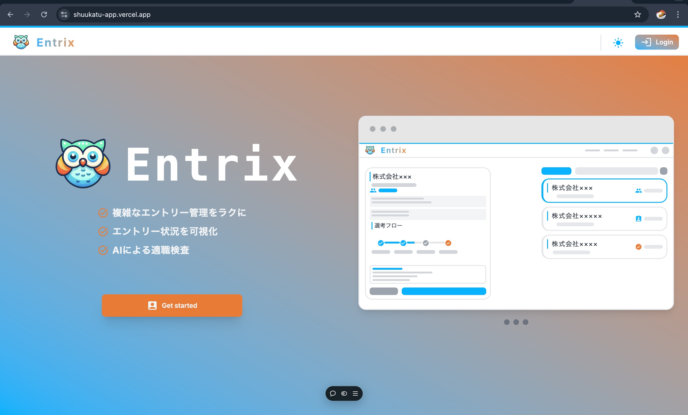
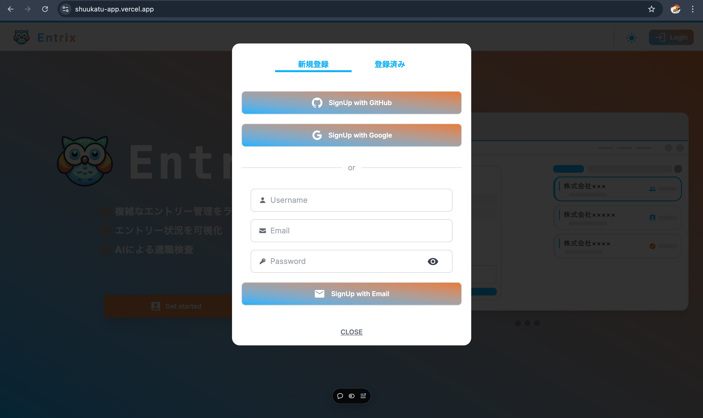
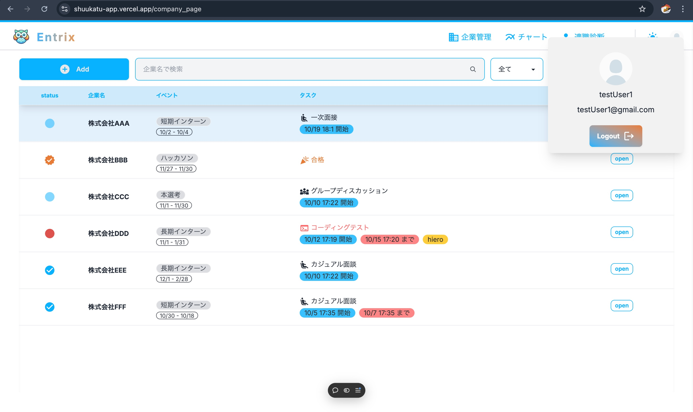
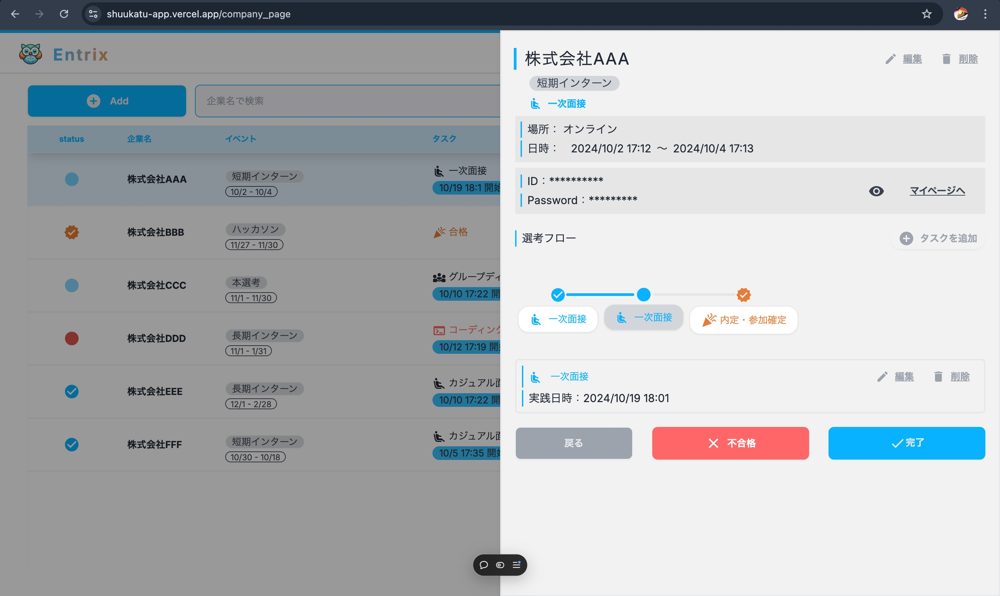
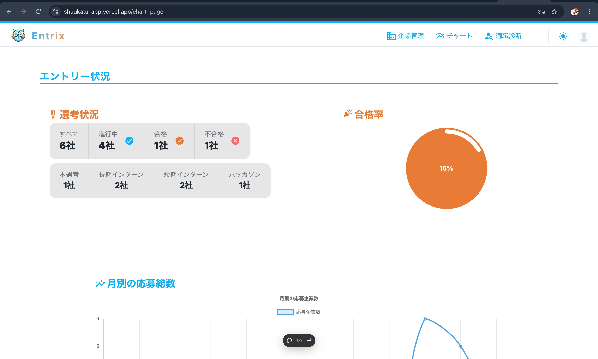
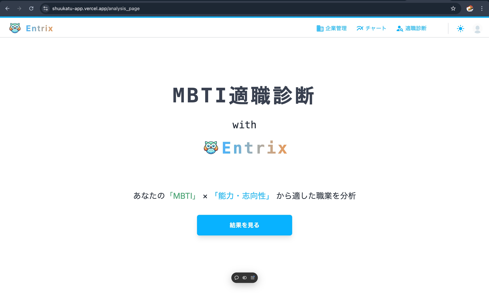
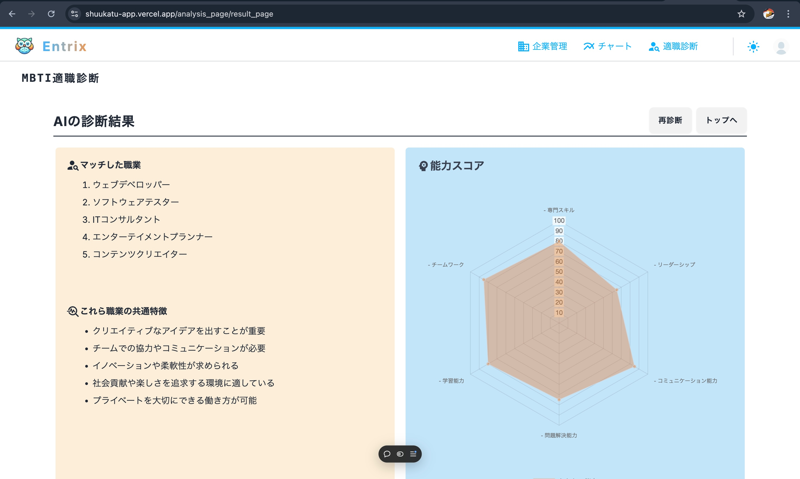

# Entrix　-就活エントリー管理アプリ-

[アプリを開く](https://shuukatu-app.vercel.app)

## 技術スタック

### その他ライブラリ

- OpenAI API ⭐
- NextAuth (OAuth・JWT)
- Chart.js
- mongoose
- React Hook Form
- Zod
- daysyUI
- Material UI Icons
   
   

## アプリの機能

### 1. エントリー企業の管理

- エントリーした企業の情報を登録
- 選考フローを可視化
- ボタンひとつで選考ステップをチェック
   

### 2. 選考状況をグラフ化

- 円グラフで合格率を確認
- 折れ線グラフで毎月のエントリー状況を確認
   

### 2. AIによる適職診断

- AIがユーザーの「MBTI」と「能力・志向性」から適した職業を提案
- 適した職業の共通項を導き出す
- 能力スコアを算出し、レーダーチャートで確認
   

## 画面

- #### トップ

- #### ログイン

- #### 企業管理

- #### チャート

- #### AI適職診断

